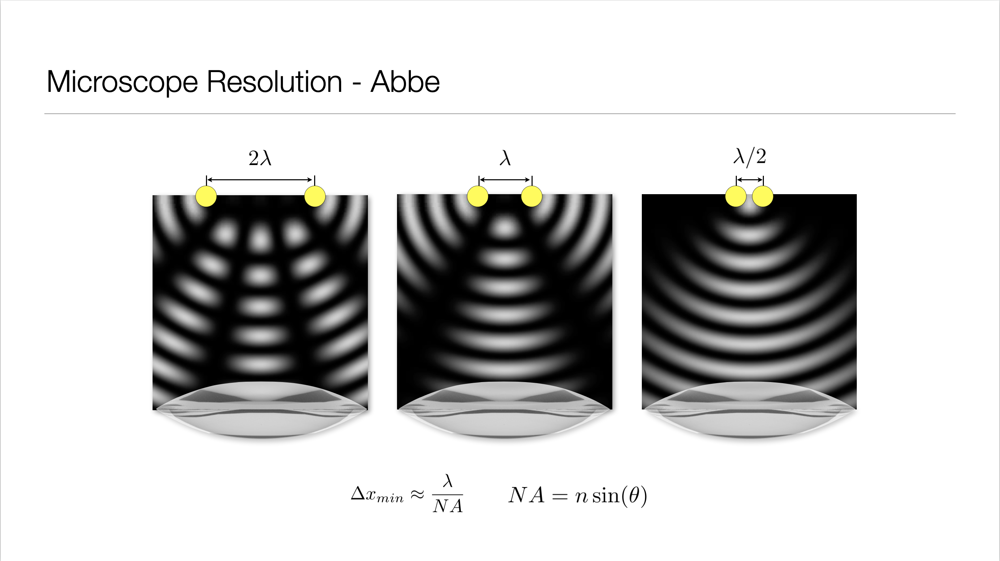

Lecture Contents
================

In Lecture 11 we look at multi-wave interference again, anti-reflection coatings and explore the diffraction of light including Huygens principle.

   

Lecture 11 slides for download :download:`pdf <Lecture 11.pdf>`