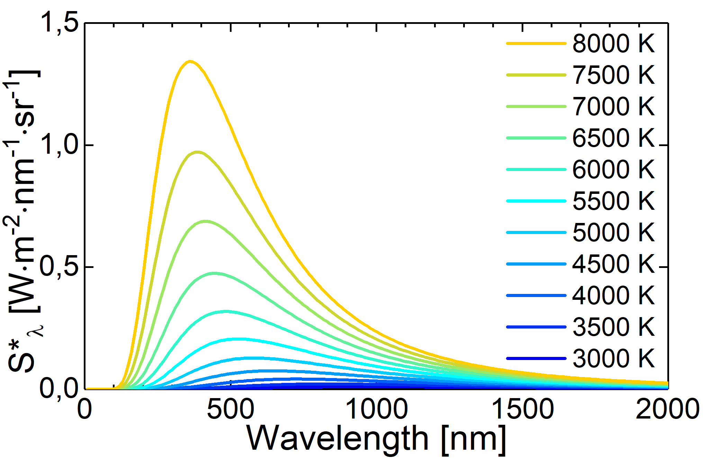

Lecture Contents
================

In Lecture 20 we will discuss the theoretical concept of blackbody radition and its real world counterart of cavity radiation. We will have a look at historical laws from Stefan and Boltzmann, Wien and Rayleigh and Jeans concerning electromagnetic radiation before we introduce teh concept of quantum mechanics on teh basis of Plancl's law of radiation.

Lecture 20 slides for download :download:`pdf <Lecture 20.pdf>`.