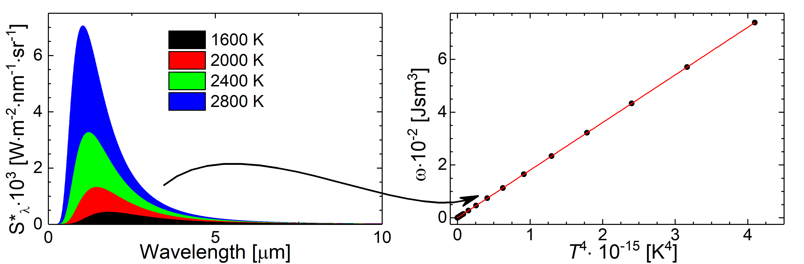

Lecture Contents
================

In Lecture 21 we will have a look at historical laws describing in part black body radiation and coincide empirical results or results derived on the basis of thermadynamic considerations with Planck's law.

Lecture 21 slides for download :download:`pdf <Lecture 21.pdf>`.