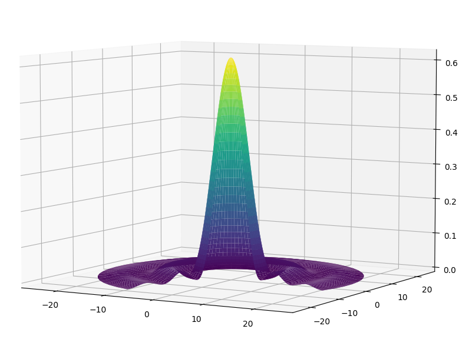

Lecture Contents
================

In Lecture 24 we will continue the discussion of matter waves with Heisenberg's uncertainty principle and apply our knowledge to derive the Bohr model. 

Lecture 24 slides for download :download:`pdf <Lecture 24.pdf>`.