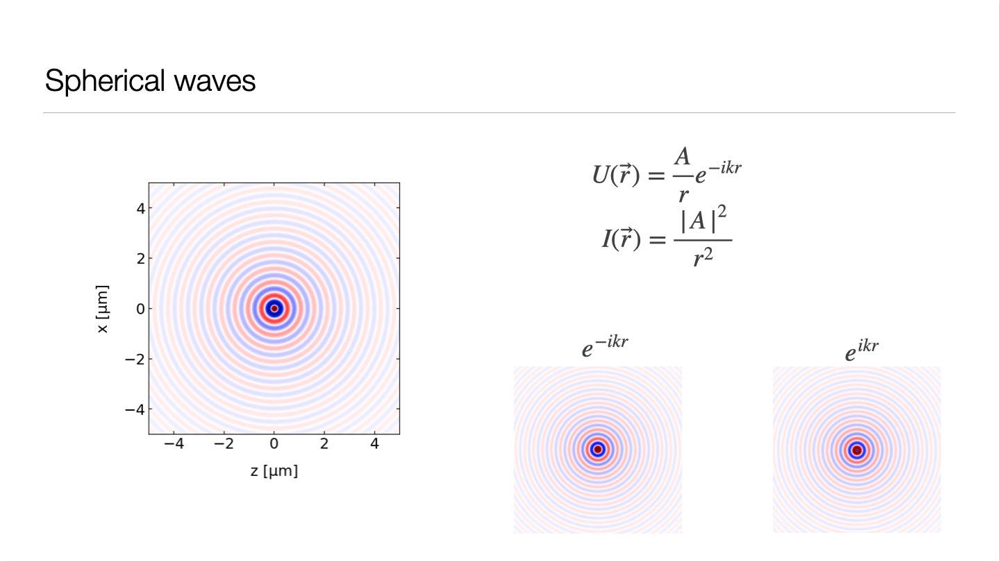

Lecture Contents
================

In Lecture 7 we discuss the different types of imaging errors, which all arise if the paraxial approximation is violated and we finally start to have a look at wave optics, which extends our understanding of light propagation.

   

Lecture 7 slides for download :download:`pdf <Lecture 7.pdf>`